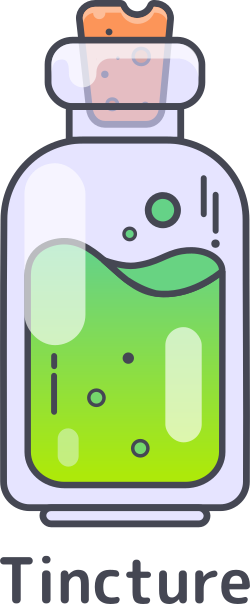

<p align="center">
  
</p>

<p align="center">
  <a href="https://circleci.com/gh/roosta/tincture">
    
  </a>
  <a href="https://clojars.org/tincture">
    
  </a>
</p>

Tincture is a frontend toolkit for ClojureScript that provides several
utility functions, components, and definitions to aid/speed up
developing common web page visuals and functionality.

-   [Documentation](https://roosta.github.io/tincture/)
-   [Demo site](http://tincture.roosta.sh)

# Requirements

Tincture requires at least Clojure 1.9.0 and ClojureScript 1.9.542
due to use of [clojure.spec.alpha](https://cljs.github.io/api/cljs.spec.alpha/) to validate various
input.

The components in this library is build using [Reagent](https://github.com/reagent-project/reagent) API, and the
event system used is [re-frame](https://github.com/Day8/re-frame). If you'd prefer some other react
framework, or no react at all this library is probably not for you.

# Usage

To use Tincture add this to your dependencies

[](http://clojars.org/tincture)

Normally Tincture includes [Reagent](https://github.com/reagent-project/reagent) and [re-frame](https://github.com/Day8/re-frame), but if you want to
use a different version of these libs exclude them from Tincture:

```clojure
[tincture "0.x.x" :exclusions [reagent re-frame]]
```

You might also optionally initialize the event system.

```clojure
(ns my-project
  (:require [tincture.core :as t]))

(defn my-init-function []
  (t/init!))
```

# Examples

See [documentation](https://roosta.github.io/tincture/) for full overview

## Grid component

```clojure
(ns my-project.my-ns
  (:require [tincture.grid :refer [Grid]]))

[Grid {:container true
       :class "my-class-name"
       :spacing 16
       :justify :center}
 [Grid {:item true
        :xs 12
        :sm 6}
  [:span "column 1"]]
 [Grid {:item true
        :xs 12
        :sm 6}
  [:span "column 2"]]
 [Grid {:item true
        :xs 12
        :sm 6}
  [:span "column 3"]]]
```

## Typography component

The typography component have the default font-family set to
`["Roboto" "Helvetica" "Arial" "sans-serif"]`, but Tincture does not
load the Roboto font automatically. It is up to the developer to
choose a method to load said font. Two options are:

- Add this markup to `index.html`:
```html
<link rel="stylesheet" href="https://fonts.googleapis.com/css?family=Roboto:300,400,500,700&display=swap" />
```

- Call `tincture.core/init!` with a provided font url and family, it
  is then attached to the head. See [Initialize](#org74b8942) section for more
  details.


### Example
```clojure
(ns my-project.my-ns
  (:require [tincture.typography :refer [Typography]]))

[:div
 [Typography {:variant :h3
              :gutter-bottom true}
  "my headline"]
 [Typography
  "My body text"]]
```

# Re-frame and Tincture events


## Initialize

Tincture uses [re-frame](https://github.com/Day8/re-frame) as an event/subscription handler, and it
can be initialized by calling `tincture.core/init!`.

`init!` take a map of options, currently a font family and a font
url. These are used in the typography component. If no options is
provided Tincture uses `["Roboto" "Helvetica" "Arial" "sans-serif"]`
as a default, and no url is attached to the head.

### Example:

``` clojure
(ns my-project
  (:require [tincture.core :as t]))

;; Add a custom font via init
(defn my-init-function []
  (t/init! {:font-family ["Raleway" "Helvetica" "Arial" "sans-serif"]
            :font-url "https://fonts.googleapis.com/css?family=Raleway:300,400,500,700&display=swap"}))
```

## Subscriptions

### :tincture/viewport-size

Returns a vector of the current viewport size: [width height]


### :tincture/viewport-width

Returns the current viewport width


### :tincture/viewport-height

Returns the current viewport height

### :tincture/font

Returns the currently used font family and url

### :tincture.font/family

Returns the currently used font family

### :tincture.font/url

Returns the currently used font url

### :tincture/device

Uses `goog.labs.userAgent.device` to return whatever device your
site is run on.

### :tincture/breakpoint-down

Takes a breakpoint, one of `#{:xs :sm :md :lg :xl}` Returns a
`boolean` that indicates if current viewport width is below the
given breakpoint. Breakpoints are defined in
`tincture.core/breakpoints` and looks like this: `{:xs 0 :sm 600 :md
     960 :lg 1280 :xl 1920}`

### :tincture/breakpoint-up

Takes a breakpoint, one of `#{:xs :sm :md :lg :xl}` Returns a
`boolean` that indicates if current viewport width is above the
given breakpoint. Breakpoints are defined in
`tincture.core/breakpoints` and looks like this: `{:xs 0 :sm 600 :md
     960 :lg 1280 :xl 1920}`

# Disclaimer

Tincture is not a UI framework, it's more a collection of various
functions and components I use on a regular basis being a frontend
developer using ClojureScript. Many components in Tincture is based on
[Material UI](https://material-ui.com/), and is a re-implementation of
those components in ClojureScript. If you want a full framework I
wholeheartedly recommend [Material UI](https://material-ui.com/).

# Sources / Inspiration

- [gradients.json](https://github.com/roosta/tincture/blob/master/resources/gradients.json) sourced from: <https://github.com/Ghosh/uiGradients/>
- [Tincture Grid](https://github.com/roosta/tincture/blob/master/src/tincture/grid.cljs) is inspired by [Material-ui Grid](https://material-ui.com/layout/grid/)
- [Tincture Typography](https://github.com/roosta/tincture/blob/master/src/tincture/typography.cljs) is inspired by [Material-ui Typography](https://material-ui.com/style/typography/)
- [Tincture Paper](https://github.com/roosta/tincture/blob/master/src/tincture/paper.cljs) is inspired by [Material-ui Paper](https://material-ui.com/components/paper/)
- [Logo](https://raw.githubusercontent.com/roosta/tincture/master/assets/tincture.svg) is inspired by the work of [Alex Kunchevsky](https://dribbble.com/kunchevsky) and [Boris Garic](https://dribbble.com/Risbo90)

# Development

Start figwheel main with the development build

```shell
lein fig:build
```

Figwheel-main will automatically push cljs changes to the browser. Once Figwheel
starts up, you should be able to open <http://localhost:9500> for the
development server.

# Testing

Either run:

```shell
lein fig:test
```

For a headless test environment using chrome, make sure its
installed on your system.

You can also start the dev build and navigate to
[http://localhost:9500/figwheel-extra-main/auto-testing](http://localhost:9500/figwheel-extra-main/auto-testing)
to get a nice interface while coding that runs the tests on each save.
